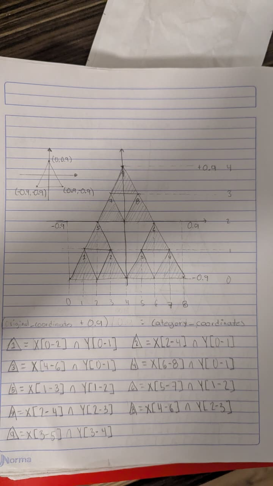
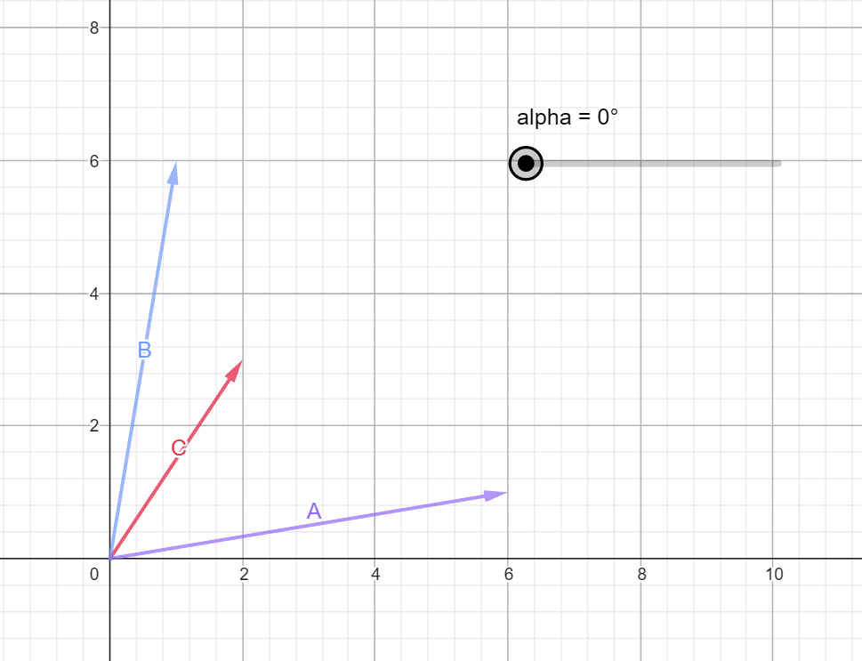
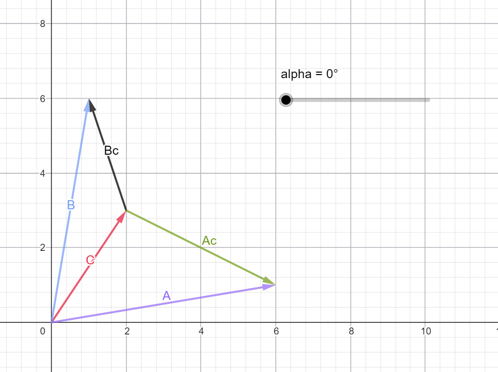

# Assignment 1: WebGL2 Intro
> CS 315 - Introduction to computer graphics assignment by **Octavio Zenil**

This is a Vite-Typescript project for making a gasket using WebGL2. This program supports:
- [x] Assigning colors to 9 subtriangles
- [x] Rotating the figure
- [x] Changing the amount of samples
- [x] Translation of the rotation center

## Index
1. [Technologies used](#technologies-used)
2. [How to run the project](#how-to-run-the-project)
3. [How did I developed this program](#how-did-i-develop-this-program)
4. [How many points to use to generate the fractal on screen into a square window?](#how-many-points-to-use-to-generate-the-fractal-on-screen-into-a-square-window)

## Technologies used :link:
- [`NodeJS`](https://nodejs.org/en)
- [`Typescript`](https://www.typescriptlang.org/)
- [`Vite`](https://vite.dev/)

I wanted to make this project on my own, using the technologies that I am more comfortable with so that I could learn exactly what is happening behind the scenes when using WebGL2

## How to run the project :link:
There are two ways of running the project, one with NodeJS and the other with the LiveServer plugin in VSCode

### With NodeJS
1. Enter the **root** directory of the project
2. Execute `npm install`
3. Execute `npm run dev`
4. Go to `http://localhost:5173`

### With LiveServer
1. Enter the **dist** directory of the project
2. Open `index.html` file with **Live Server**

## How did I develop this program :link:
Making up this program involved three general steps:
1. [Generating the samples](#generating-the-samples)
2. [Assgin colors](#assign-colors)
3. [Rotate the figure](#rotate-the-figure)
4. [Change the rotation center](#change-the-rotation-center)

They involved several steps before even starting programming.

### Generating the samples
1. The first thing that I had to come with was defining the attributes or uniforms that I needed so I defined:
    * _PointSize_
    * _PointLocation_
    * _Color_

2. Then, after binding everything up with the shaders I had to generate the points, and for that I defined a function named `getData` for generating them.

    If the new amount of samples was lesser than before, it just cuts the array to the new size and if it was more, it just generated the missing points following the algorithm

    The algorithm is made with an iterative call to `getMidPoint` using the most recently generated point with one of the original vertex of the **triangle**.

3. Then I created a `render` function for being called each time one of the parameters changed. In this function I mapped each point into a single array using the **reduce** function, **giving special styling to the initial vertices**

4. After that, I wrote the event listener for the number of samples with an `<input type="range"/>` and calling the **input** event so you could have updates while sliding.

### Assign colors
This was the hardest part by far because I wasn't very sure how to implement this at the begining

1. The first thing I did was to draw on my notebook a simplified version of the _gasket_ so that I could see how to identify each area for the triangles.

2. Then I defined the areas where each triangle was located.

3. After that I started programing the `generateCategorizer` function. I made it this way so that my global variables could be used and for separating this method into a new file. This way I just had to execute it with `width` and `height` parameters so I could get the categorizer function.

4. Then I created the colors array and called the function in the **reduce** so I could get the <ins>RGB</ins> values for each point depending on its location.

### Rotate the figure

This was the easiest part by far because I already had everything setted up to be implemented.

1. The first thing that I did was to see **each point as a vector** and apply the **rotation matrix**

2. Then I created a function named `rotatePoint` that accepts **a point and rad** values for applying the transformation

3. As a final step I called that function in the **reduce** and use them for the final plot

4. Then I created the controls for changing the rotation, making use of two buttons, one for rotating to the right and the other for the left. I created a global variable for saving the amount of radians rotated by each step and another for saving the state of the current rotation

### Change the rotation center

> The charts utilized here were made with [Geogebra](https://geogebra.org)

1. In this part I only had to think about on what does substraction mean geometrically.

2. To visualize this lets suppose that I have two vectors that I want to rotate: `A` and `B`. The given center is `C` so we need to do something before applying the rotation matrix.

3. So what we need to do is to substract `C` from `A` and `B`, to "move" their start point to the tip of `C`. The new vectors from this operation are `Ac` and `Bc`.

4. Now that the vectors will rotate on `C`'s tip, we can apply the transformation matrix.

5. As the final step we only need to add back `C` to the rotated vectos `Ac` and `Bc`.

## How many points to use to generate the fractal on screen into a square window. :link:
This depends on how big the window is and how big are the points but I can say that the whole shape starts getting visible with 10,000 samples but it seems complete with 20,000. 

> I used a **600x600** screen and point size of **2** for this experiment. 